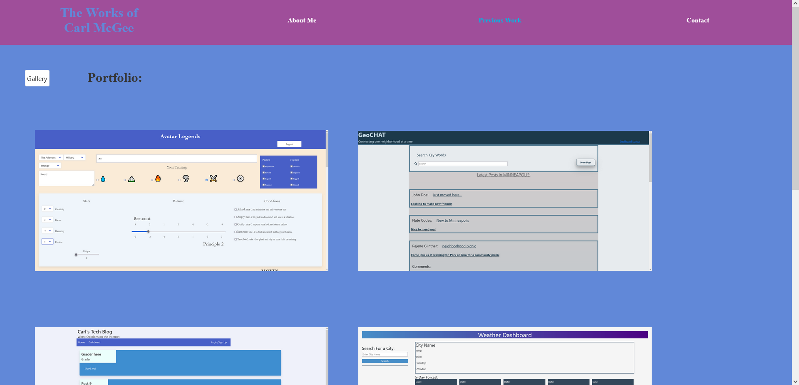

# Carl's React Portfolio

## Description

This is my web development portfolio made using vanilla REACT. It was designed to showcase my projects as well as my REACT skills in a mobile first, single page webapp. Each project screenshot links to its respective deployed site and has links to their repos on Github. I will add projects as I complete them.

## Table of Contents

- [Installation](#installation)

- [Usage](#usage)

- [Credits](#credits)

- [License](#license)

- [Contributing](#contributing)

- [Tests](#tests)

- [Questions](#questions)

## Usage

As a new web developer, I want a site to showcase my work to potential employers.

## Credits

Created by CarlJMcGee

## Questions?

If you have any issues, submit them to my [Github](https://github.com/CarlJMcGee)

or

If you have any other questions or inquiries, you can contact me at [Carl.jack.mcgee@gmail.com](mailto:Carl.jack.mcgee@gmail.com)

## [Check it Out](https://carljmcgee.github.io/carls-react-portfolio/)

<a href="https://carljmcgee.github.io/carls-react-portfolio/"><a/>
